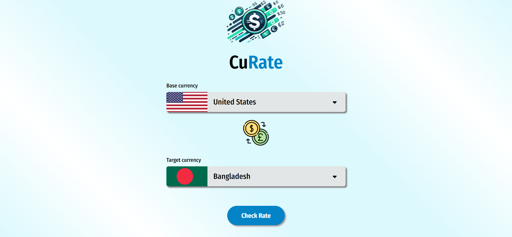
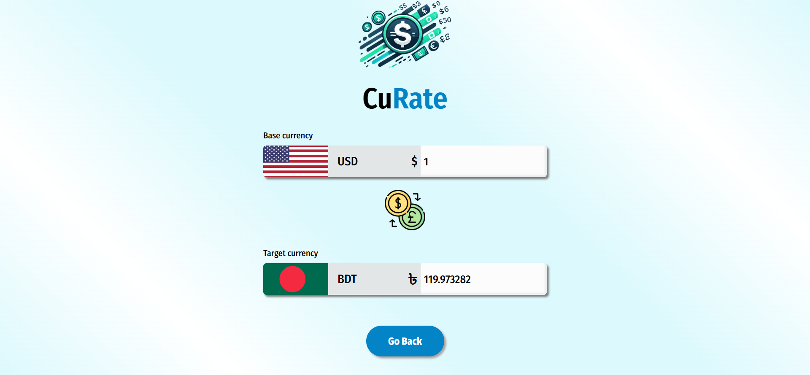
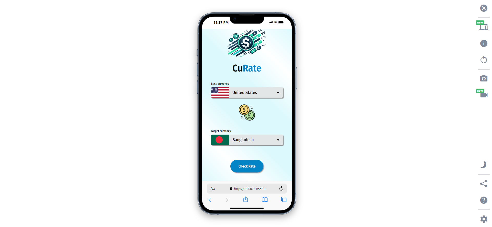
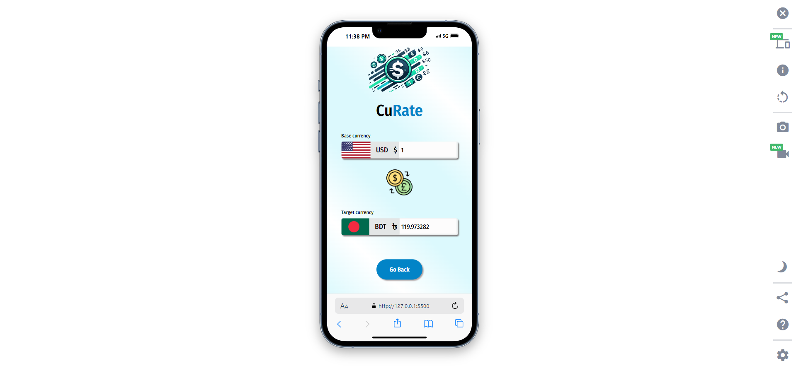

# **CuRate - Currency Converter** 💱🌍


**CuRate** is a simple and efficient currency converter application that allows you to convert currencies between any two countries! You can easily see the conversion for both the base and target values. Perfect for travelers, businesses, or anyone dealing with foreign currencies!

---

## 🌟 **Features**

- 🌐 **242 Countries Supported:** Select from 242 countries for currency conversion.
- 🔄 **Bi-directional Conversion:** Enter values in either the base or target currency fields, and the app will automatically calculate the corresponding amount.
- 📊 **Real-Time Calculation:** Instant conversion based on the provided amount and selected currencies.
- 💻 **Fully Responsive:** Optimized for desktops, tablets, and mobile devices.

---

## 🖥️ **Demo**

🚀 **[Live Demo](https://abdur-rahman-apu.github.io/CuRate/)**

---

## 🛠️ **Technologies Used**

| Technology     | Description                        |
| -------------- | ---------------------------------- |
| **HTML**       | For structuring the application    |
| **CSS**        | For styling the user interface     |
| **JavaScript** | For functionality and calculations |

---

## 📷 **Screenshots**

| Desktop View                                                                                                                                                | Mobile View                                                                                                                                             |
| ----------------------------------------------------------------------------------------------------------------------------------------------------------- | ------------------------------------------------------------------------------------------------------------------------------------------------------- |
|  |  |

---

## ⚙️ **How It Works**

1. **Select the Base Country** 🇺🇸: Choose the country you want to convert **from** in the first dropdown.
2. **Select the Target Country** 🇪🇺: Choose the country you want to convert **to** in the second dropdown.
3. **Enter Amounts**: Enter the amount in either the base or target currency input, and the equivalent value will be calculated instantly.
4. **Real-Time Updates** 🔄: The app updates the converted amount in real-time when any value changes.

---

## 🧰 **How to Use**

### **Installation**

1. Clone this repository:
   ```bash
   git clone https://github.com/Abdur-Rahman-Apu/CuRate.git
   ```
2. Open `index.html` in your favorite browser.

---

## 🌐 **Dataset**

- The app uses a dataset of 242 countries based on the API response for accurate currency conversion.

---

## 🛠️ **Project Structure**

```bash
📦 CuRate
├─ 📂 Styles
│ └─ style.css # All CSS styles
├─ 📂 JS
    └─ 📂 modules
      └─ 📂config # Global Data State
      └─ 📂db # Store data into the storage
      └─ 📂elements # Select HTML elements
      └─ 📂handlers # Handle Events
      └─ 📂init # Initial function
      └─ 📂listeners # Listeners
      └─ 📂ui # Update the DOM
      └─ 📂utilities # Utility functions
    └─ app.js # Main logic for conversion
│
├─ index.html # Main structure of the application
└─ README.md # Project documentation
```

---

## 📜 **License**

This project is licensed under the MIT License - see the [LICENSE](LICENSE) file for details.

---

## 👨‍💻 **Author**

**Abdur Rahman Apu**

- 💼 [LinkedIn](https://www.linkedin.com/in/abdur-rahman-apu/)
- 💻 [GitHub](https://github.com/Abdur-Rahman-Apu)

---

## ⭐ **Show Your Support**

If you like this project, feel free to give it a ⭐ on GitHub!
